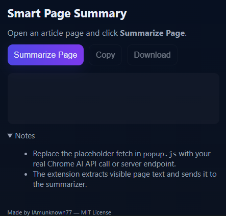

# smart-web-page-summary
Smart Page Summary is a lightweight Chrome extension that uses AI to generate instant summaries of any web page. With one click, it condenses long articles, blog posts, or news stories into clear, concise summaries — saving you time and helping you focus on what matters most.

